English | [简体中文](./README.md) 

# Wechart by [Cax](https://github.com/dntzhang/cax)

> All the [ch]arts by cax and three.js.

<table>
<thead>
<tr>
<th align="center">Demo</th>
<th align="center">Usage Source</th>
<th align="center">Group Source</th>
<th align="center">Tutorial</th>
</tr>
</thead>
<tbody>
<tr>
<td align="center"><a title="Word Penetrating" href="https://dntzhang.github.io/wechart/packages/word-penetrating/examples/simple/" rel="nofollow">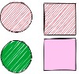</a></td>
<td align="center"><a href="https://github.com/dntzhang/wechart/blob/master/packages/word-penetrating/examples/simple/">Source</a></td>
<td align="center">Word Penetrating</td>
<td align="center">Tutorial</td>
</tr>

<tr>
<td align="center"><a title="Skatch" href="https://dntzhang.github.io/wechart/packages/skatch/examples/simple/" rel="nofollow">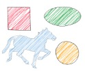</a></td>
<td align="center"><a href="https://github.com/dntzhang/wechart/blob/master/packages/skatch/examples/simple/main.js">Source</a></td>
<td align="center"><a href="https://github.com/dntzhang/wechart/blob/master/packages/skatch/src/">Skatch Source</a></td>
<td align="center">Tutorial</td>
</tr>

<tr>
<td align="center"><a title="Filter" href="https://dntzhang.github.io/wechart/packages/filter/examples/simple/" rel="nofollow">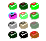</a></td>
<td align="center"><a href="https://github.com/dntzhang/wechart/blob/master/packages/filter/examples/simple/main.js">Source</a></td>
<td align="center"><a href="https://github.com/dntzhang/cax/tree/master/packages/cax/src/render/filter">Filter Source</a></td>
<td align="center">Tutorial</td>
</tr>

<tr>
<td align="center"><a title="Functions" href="https://dntzhang.github.io/wechart/packages/functions/examples/simple/" rel="nofollow">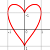</a></td>
<td align="center"><a href="https://github.com/dntzhang/wechart/blob/master/packages/functions/examples/simple/main.js">Source</a></td>
<td align="center"><a href="https://github.com/dntzhang/wechart/blob/master/packages/functions/src/index.js">Functions Source</a></td>
<td align="center">Tutorial</td>
</tr>

<tr>
<td align="center"></td>
<td align="center"><a href="https://github.com/dntzhang/wechart/blob/master/packages/path/examples/racing/main.js">Source</a></td>
<td align="center">Racing Source</td>
<td align="center">Tutorial</td>
</tr>

<tr>
<td align="center"><a title="Magic Cube" href="https://dntzhang.github.io/wechart/packages/magic-cube/examples/simple/" rel="nofollow">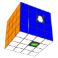</a></td>
<td align="center"><a href="https://github.com/dntzhang/wechart/blob/master/packages/magic-cube/examples/simple/main.js">Source</a></td>
<td align="center"><a href="https://github.com/dntzhang/wechart/blob/master/packages/magic-cube/src/index.js">Magic Cube Source</a></td>
<td align="center">Tutorial</td>
</tr>

<tr>
<td align="center"><a title="Mandelbrot Set" href="https://dntzhang.github.io/wechart/packages/mandelbrot-set/examples/simple/" rel="nofollow">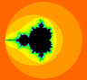</a></td>
<td align="center"><a href="https://github.com/dntzhang/wechart/blob/master/packages/mandelbrot-set/examples/simple/main.js">Source</a></td>
<td align="center">Mandelbrot Set Source</td>
<td align="center"><a href="https://github.com/dntzhang/wechart/blob/master/packages/mandelbrot-set/README.md">Tutorial</a></td>
</tr>

<tr>
<td align="center"></td>
<td align="center"><a href="https://github.com/dntzhang/wechart/blob/master/packages/avatar/examples/simple/main.js">Source</a></td>
<td align="center">Avatar Source</td>
<td align="center">Tutorial</td>
</tr>

<tr>
<td align="center"></td>
<td align="center"><a href="https://github.com/dntzhang/wechart/blob/master/packages/loading/examples/simple/main.js">Source</a></td>
<td align="center"><a href="https://github.com/dntzhang/wechart/blob/master/packages/loading/src/index.js">Loading Source</a></td>
<td align="center">Tutorial</td>
</tr>

<tr>
<td align="center"></td>
<td align="center"><a href="https://github.com/dntzhang/wechart/blob/master/packages/countdown/examples/simple/main.js">Source</a></td>
<td align="center"><a href="https://github.com/dntzhang/wechart/blob/master/packages/countdown/src/index.js">Countdown Source</a></td>
<td align="center">Tutorial</td>
</tr>

<tr>
<td align="center"><a title="Particle Countdown" href="https://dntzhang.github.io/wechart/packages/countdown/examples/particle/" rel="nofollow">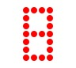</a></td>
<td align="center"><a href="https://github.com/dntzhang/wechart/blob/master/packages/countdown/examples/particle/main.js">Source</a></td>
<td align="center">Particle Countdown Source</td>
<td align="center">Tutorial</td>
</tr>

<tr>
<td align="center"></td>
<td align="center"><a href="https://github.com/dntzhang/wechart/blob/master/packages/map3d/examples/simple/main.js">Source</a></td>
<td align="center"><a href="https://github.com/dntzhang/wechart/blob/master/packages/map3d/src/index.js">Map3d Source</a></td>
<td align="center">Tutorial</td>
</tr>
<tr>
<td align="center"></td>
<td align="center"><a href="https://github.com/dntzhang/wechart/blob/master/packages/earth/examples/simple/main.js">Source</a></td>
<td align="center"><a href="https://github.com/dntzhang/wechart/blob/master/packages/earth/src/index.js">Earth Source</a></td>
<td align="center">Tutorial</td>
</tr>

<tr>
<td align="center"><a title="WordCloud" href="https://dntzhang.github.io/wechart/packages/word-cloud/examples/simple/" rel="nofollow">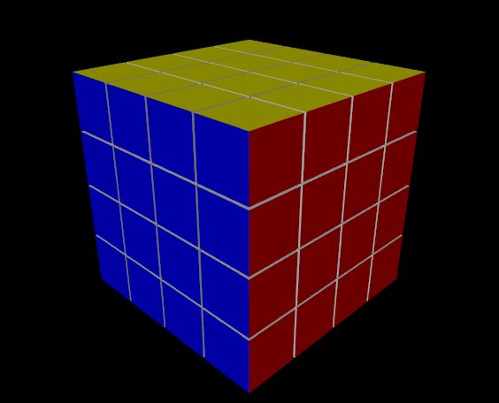</a></td>
<td align="center"><a href="https://github.com/dntzhang/wechart/blob/master/packages/word-cloud/examples/simple/main.js">Source</a></td>
<td align="center"><a href="https://github.com/dntzhang/wechart/blob/master/packages/word-cloud/src/index.js">WordCloud Source</a></td>
<td align="center">Tutorial</td>
</tr>

<tr>
<td align="center"></td>
<td align="center"><a href="https://github.com/dntzhang/wechart/blob/master/packages/word-sphere/examples/simple/main.js">Source</a></td>
<td align="center"><a href="https://github.com/dntzhang/wechart/blob/master/packages/word-sphere/src/index.js">WordSphere Source</a></td>
<td align="center">Tutorial</td>
</tr>

<tr>
<td align="center"></td>
<td align="center"><a href="https://github.com/dntzhang/wechart/blob/master/packages/clock/examples/simple/main.js">Source</a></td>
<td align="center"><a href="https://github.com/dntzhang/wechart/blob/master/packages/clock/src/index.js">Clock Source</a></td>
<td align="center">Tutorial</td>
</tr>
<tr>
<td align="center"></td>
<td align="center"><a href="https://github.com/dntzhang/wechart/blob/master/packages/excel/examples/simple/main.js">Source</a></td>
<td align="center"><a href="https://github.com/dntzhang/wechart/blob/master/packages/excel/src/index.js">Excel Source</a></td>
<td align="center">Tutorial</td>
</tr>
<tr>
<td align="center"></td>
<td align="center"><a href="https://github.com/dntzhang/wechart/blob/master/packages/pie/examples/simple/main.js">Source</a></td>
<td align="center"><a href="https://github.com/dntzhang/wechart/blob/master/packages/pie/src/index.js">Pie Source</a></td>
<td align="center"><a href="https://github.com/dntzhang/wechart/blob/master/packages/pie/README.md">Tutorial</a></td>
</tr>

<tr>
<td align="center"></td>
<td align="center"><a href="https://github.com/dntzhang/wechart/blob/master/packages/bar/examples/simple/main.js">Source</a></td>
<td align="center" rowspan="2"><a href="https://github.com/dntzhang/wechart/blob/master/packages/bar/src/index.js">Bar Source</a></td>
<td align="center">Tutorial</td>
</tr>
<tr>
<td align="center"></td>
<td align="center"><a href="https://github.com/dntzhang/wechart/blob/master/packages/bar/examples/horizontal/main.js">Source</a></td>

<td align="center">Tutorial</td>
</tr>
<tr>
<td align="center"></td>
<td align="center"><a href="https://github.com/dntzhang/wechart/blob/master/packages/cylinder/examples/simple/main.js">Source</a></td>
<td align="center"><a href="https://github.com/dntzhang/wechart/blob/master/packages/cylinder/src/index.js">Cylinder Source</a></td>
<td align="center"><a href="https://github.com/dntzhang/wechart/blob/master/packages/cylinder/README.md">Tutorial</a></td>
</tr>
<tr>
<td align="center"></td>
<td align="center"><a href="https://github.com/dntzhang/wechart/blob/master/packages/line/examples/simple/main.js">Source</a></td>
<td align="center"><a href="https://github.com/dntzhang/wechart/blob/master/packages/line/src/index.js">Line Source</a></td>
<td align="center">Tutorial</td>
</tr>
<tr>
<td align="center"></td>
<td align="center"><a href="https://github.com/dntzhang/wechart/blob/master/packages/graph/examples/simple/main.js">Source</a></td>
<td align="center"><a href="https://github.com/dntzhang/wechart/blob/master/packages/graph/src/index.js">Graph Source</a></td>
<td align="center">Tutorial</td>
</tr>
<tr>
<td align="center"></td>
<td align="center"><a href="https://github.com/dntzhang/wechart/blob/master/packages/map/examples/simple/main.js">Source</a></td>
<td align="center"><a href="https://github.com/dntzhang/wechart/blob/master/packages/map/src/index.js">Map Source</a></td>
<td align="center">Tutorial</td>
</tr>
<tr>
<td align="center"></td>
<td align="center"><a href="https://github.com/dntzhang/wechart/blob/master/packages/radar/examples/simple/main.js">Source</a></td>
<td align="center"><a href="https://github.com/dntzhang/wechart/blob/master/packages/radar/src/index.js">Radar Source</a></td>
<td align="center">Tutorial</td>
</tr>
<tr>
<td align="center"></td>
<td align="center"><a href="https://github.com/dntzhang/wechart/blob/master/packages/map/examples/tiger/main.js">Source</a></td>
<td align="center">Tiger Source</td>
<td align="center">Tutorial</td>
</tr>

<tr>
<td align="center"></td>
<td align="center"><a href="https://github.com/dntzhang/wechart/blob/master/packages/path/examples/man/main.js">Source</a></td>
<td align="center">Draw Source</td>
<td align="center">Tutorial</td>
</tr>

<tr>
<td align="center"></td>
<td align="center"><a href="https://github.com/dntzhang/wechart/blob/master/packages/pyramid3d/examples/simple/main.js">Source</a></td>
<td align="center"><a href="https://github.com/dntzhang/wechart/blob/master/packages/pyramid3d/src/index.js">Pyramid3d Source</a></td>
<td align="center">Tutorial</td>
</tr>
<tr>
<td align="center"></td>
<td align="center"><a href="https://github.com/dntzhang/wechart/blob/master/packages/bar3d/examples/simple/main.js">Source</a></td>
<td align="center"><a href="https://github.com/dntzhang/wechart/blob/master/packages/bar3d/src/index.js">Bar3d Source</a></td>
<td align="center">Tutorial</td>
</tr>
<tr>
<td align="center"></td>
<td align="center"><a href="https://github.com/dntzhang/wechart/blob/master/packages/pie3d/examples/simple/main.js">Source</a></td>
<td align="center"><a href="https://github.com/dntzhang/wechart/blob/master/packages/pie3d/src/index.js">Pie3d Source</a></td>
<td align="center">Tutorial</td>
</tr>

<tr>
<td align="center"><a title="Texture Mapping" href="https://dntzhang.github.io/wechart/packages/texture-mapping/examples/simple/" rel="nofollow">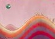</a></td>
<td align="center"><a href="https://github.com/dntzhang/wechart/blob/master/packages/texture-mapping/examples/simple/main.js">Source</a></td>
<td align="center">Texture Mapping Source</td>
<td align="center">Tutorial</td>
</tr>

<tr>
<td align="center"><a title="Heatmap" href="https://dntzhang.github.io/wechart/packages/heatmap/examples/simple/" rel="nofollow">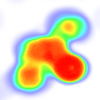</a></td>
<td align="center"><a href="https://github.com/dntzhang/wechart/blob/master/packages/heatmap/examples/simple/main.js">Source</a></td>
<td align="center"><a href="https://github.com/dntzhang/wechart/blob/master/packages/heatmap/src/index.js">Heatmap Source</a></td>
<td align="center"><a href="https://github.com/dntzhang/wechart/blob/master/packages/heatmap/README.md">Tutorial</a></td>
</tr>

<tr>
<td align="center"><a title="Astar" href="https://dntzhang.github.io/wechart/packages/astar/" rel="nofollow">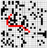</a></td>
<td align="center"><a href="https://github.com/dntzhang/wechart/blob/master/packages/astar">Source</a></td>
<td align="center">Astar Source</td>
<td align="center">Tutorial</td>
</tr>

</tbody></table>

# Who is using cax?

  

## License

MIT @Tencent Wepay @Wechart Team @Tencent AlloyTeam
