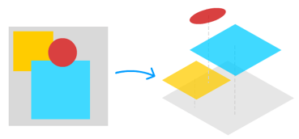

简体中文 | [English](./README.EN.md) 

# Wechart

> [Cax](https://github.com/dntzhang/cax) 渲染精巧图表

* [Pie](https://dntzhang.github.io/wechart/packages/pie/examples/simple/) | [Source](https://github.com/dntzhang/wechart/blob/master/packages/pie/examples/simple/main.js) | [Pie Source](https://github.com/dntzhang/wechart/blob/master/packages/pie/src/index.js) | [Tutorial](https://github.com/dntzhang/wechart/blob/master/packages/pie/README.md)
* [Axis](https://dntzhang.github.io/wechart/packages/axis/examples/simple/) | [Source](https://github.com/dntzhang/wechart/blob/master/packages/axis/examples/simple/main.js) | [Axis Source](https://github.com/dntzhang/wechart/blob/master/packages/axis/src/index.js) | [Tutorial](https://github.com/dntzhang/wechart/blob/master/packages/axis/README.md)
* [Bar](https://dntzhang.github.io/wechart/packages/bar/examples/simple/) | [Source](https://github.com/dntzhang/wechart/blob/master/packages/bar/examples/simple/main.js) | [Bar Source](https://github.com/dntzhang/wechart/blob/master/packages/bar/src/index.js) | [Tutorial](https://github.com/dntzhang/wechart/blob/master/packages/bar/README.md)
* [Cylinder](https://dntzhang.github.io/wechart/packages/cylinder/examples/simple/) | [Source](https://github.com/dntzhang/wechart/blob/master/packages/cylinder/examples/simple/main.js) | [Cylinder Source](https://github.com/dntzhang/wechart/blob/master/packages/cylinder/src/index.js) 

## 谁在使用？

  

## 微信交流群

## License

MIT
