简体中文 | [English](./README.EN.md) 

# Wechart by [Cax](https://github.com/dntzhang/cax)

> Cax 和 three.js 渲染精巧图[表]

<table>
<thead>
<tr>
<th align="center">Demo</th>
<th align="center">Usage Source</th>
<th align="center">Group Source</th>
<th align="center">Tutorial</th>
</tr>
</thead>
<tbody>
<tr>
<td align="center"><a title="Avatar" href="https://dntzhang.github.io/wechart/packages/avatar/examples/simple/" rel="nofollow"></a></td>
<td align="center"><a href="https://github.com/dntzhang/wechart/blob/master/packages/avatar/examples/simple/main.js">Source</a></td>
<td align="center">Avatar Source</td>
<td align="center">Tutorial</td>
</tr>

<tr>
<td align="center"><a title="Loading" href="https://dntzhang.github.io/wechart/packages/loading/examples/simple/" rel="nofollow">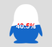</a></td>
<td align="center"><a href="https://github.com/dntzhang/wechart/blob/master/packages/loading/examples/simple/main.js">Source</a></td>
<td align="center"><a href="https://github.com/dntzhang/wechart/blob/master/packages/loading/src/index.js">Loading Source</a></td>
<td align="center">Tutorial</td>
</tr>

<tr>
<td align="center"><a title="Countdown" href="https://dntzhang.github.io/wechart/packages/countdown/examples/simple/" rel="nofollow"></a></td>
<td align="center"><a href="https://github.com/dntzhang/wechart/blob/master/packages/countdown/examples/simple/main.js">Source</a></td>
<td align="center"><a href="https://github.com/dntzhang/wechart/blob/master/packages/countdown/src/index.js">Countdown Source</a></td>
<td align="center">Tutorial</td>
</tr>

<tr>
<td align="center"><a title="Map3d" href="https://dntzhang.github.io/wechart/packages/map3d/examples/simple/" rel="nofollow">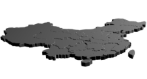</a></td>
<td align="center"><a href="https://github.com/dntzhang/wechart/blob/master/packages/map3d/examples/simple/main.js">Source</a></td>
<td align="center"><a href="https://github.com/dntzhang/wechart/blob/master/packages/map3d/src/index.js">Map3d Source</a></td>
<td align="center">Tutorial</td>
</tr>
<tr>
<td align="center"><a title="Earth" href="https://dntzhang.github.io/wechart/packages/earth/examples/simple/" rel="nofollow">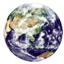</a></td>
<td align="center"><a href="https://github.com/dntzhang/wechart/blob/master/packages/earth/examples/simple/main.js">Source</a></td>
<td align="center"><a href="https://github.com/dntzhang/wechart/blob/master/packages/earth/src/index.js">Earth Source</a></td>
<td align="center">Tutorial</td>
</tr>

<tr>
<td align="center"><a title="WordCloud" href="https://dntzhang.github.io/wechart/packages/word-cloud/examples/simple/" rel="nofollow"></a></td>
<td align="center"><a href="https://github.com/dntzhang/wechart/blob/master/packages/word-cloud/examples/simple/main.js">Source</a></td>
<td align="center"><a href="https://github.com/dntzhang/wechart/blob/master/packages/word-cloud/src/index.js">WordCloud Source</a></td>
<td align="center">Tutorial</td>
</tr>

<tr>
<td align="center"><a title="WordSphere" href="https://dntzhang.github.io/wechart/packages/word-sphere/examples/simple/" rel="nofollow"></a></td>
<td align="center"><a href="https://github.com/dntzhang/wechart/blob/master/packages/word-sphere/examples/simple/main.js">Source</a></td>
<td align="center"><a href="https://github.com/dntzhang/wechart/blob/master/packages/word-sphere/src/index.js">WordSphere Source</a></td>
<td align="center">Tutorial</td>
</tr>

<tr>
<td align="center"><a title="Clock" href="https://dntzhang.github.io/wechart/packages/clock/examples/simple/" rel="nofollow"></a></td>
<td align="center"><a href="https://github.com/dntzhang/wechart/blob/master/packages/clock/examples/simple/main.js">Source</a></td>
<td align="center"><a href="https://github.com/dntzhang/wechart/blob/master/packages/clock/src/index.js">Clock Source</a></td>
<td align="center">Tutorial</td>
</tr>
<tr>
<td align="center"><a title="Excel" href="https://dntzhang.github.io/wechart/packages/excel/examples/simple/" rel="nofollow"></a></td>
<td align="center"><a href="https://github.com/dntzhang/wechart/blob/master/packages/excel/examples/simple/main.js">Source</a></td>
<td align="center"><a href="https://github.com/dntzhang/wechart/blob/master/packages/excel/src/index.js">Excel Source</a></td>
<td align="center">Tutorial</td>
</tr>
<tr>
<td align="center"><a title="Pie" href="https://dntzhang.github.io/wechart/packages/pie/examples/simple/" rel="nofollow">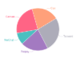</a></td>
<td align="center"><a href="https://github.com/dntzhang/wechart/blob/master/packages/pie/examples/simple/main.js">Source</a></td>
<td align="center"><a href="https://github.com/dntzhang/wechart/blob/master/packages/pie/src/index.js">Pie Source</a></td>
<td align="center"><a href="https://github.com/dntzhang/wechart/blob/master/packages/pie/README.md">Tutorial</a></td>
</tr>

<tr>
<td align="center"><a title="Bar" href="https://dntzhang.github.io/wechart/packages/bar/examples/simple/" rel="nofollow">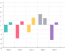</a></td>
<td align="center"><a href="https://github.com/dntzhang/wechart/blob/master/packages/bar/examples/simple/main.js">Source</a></td>
<td align="center" rowspan="2"><a href="https://github.com/dntzhang/wechart/blob/master/packages/bar/src/index.js">Bar Source</a></td>
<td align="center">Tutorial</td>
</tr>
<tr>
<td align="center"><a title="Bar" href="https://dntzhang.github.io/wechart/packages/bar/examples/horizontal/" rel="nofollow">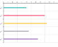</a></td>
<td align="center"><a href="https://github.com/dntzhang/wechart/blob/master/packages/bar/examples/horizontal/main.js">Source</a></td>

<td align="center">Tutorial</td>
</tr>
<tr>
<td align="center"><a title="Cylinder" href="https://dntzhang.github.io/wechart/packages/cylinder/examples/simple/" rel="nofollow">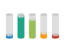</a></td>
<td align="center"><a href="https://github.com/dntzhang/wechart/blob/master/packages/cylinder/examples/simple/main.js">Source</a></td>
<td align="center"><a href="https://github.com/dntzhang/wechart/blob/master/packages/cylinder/src/index.js">Cylinder Source</a></td>
<td align="center"><a href="https://github.com/dntzhang/wechart/blob/master/packages/cylinder/README.md">Tutorial</a></td>
</tr>
<tr>
<td align="center"><a title="Line" href="https://dntzhang.github.io/wechart/packages/line/examples/simple/" rel="nofollow">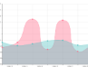</a></td>
<td align="center"><a href="https://github.com/dntzhang/wechart/blob/master/packages/line/examples/simple/main.js">Source</a></td>
<td align="center"><a href="https://github.com/dntzhang/wechart/blob/master/packages/line/src/index.js">Line Source</a></td>
<td align="center">Tutorial</td>
</tr>
<tr>
<td align="center"><a title="Graph" href="https://dntzhang.github.io/wechart/packages/graph/examples/simple/" rel="nofollow">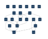</a></td>
<td align="center"><a href="https://github.com/dntzhang/wechart/blob/master/packages/graph/examples/simple/main.js">Source</a></td>
<td align="center"><a href="https://github.com/dntzhang/wechart/blob/master/packages/graph/src/index.js">Graph Source</a></td>
<td align="center">Tutorial</td>
</tr>
<tr>
<td align="center"><a title="Map" href="https://dntzhang.github.io/wechart/packages/map/examples/simple/" rel="nofollow">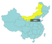</a></td>
<td align="center"><a href="https://github.com/dntzhang/wechart/blob/master/packages/map/examples/simple/main.js">Source</a></td>
<td align="center"><a href="https://github.com/dntzhang/wechart/blob/master/packages/map/src/index.js">Map Source</a></td>
<td align="center">Tutorial</td>
</tr>
<tr>
<td align="center"><a title="Radar" href="https://dntzhang.github.io/wechart/packages/radar/examples/simple/" rel="nofollow">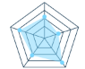</a></td>
<td align="center"><a href="https://github.com/dntzhang/wechart/blob/master/packages/radar/examples/simple/main.js">Source</a></td>
<td align="center"><a href="https://github.com/dntzhang/wechart/blob/master/packages/radar/src/index.js">Radar Source</a></td>
<td align="center">Tutorial</td>
</tr>
<tr>
<td align="center"><a title="Tiger" href="https://dntzhang.github.io/wechart/packages/map/examples/tiger/" rel="nofollow"></a></td>
<td align="center"><a href="https://github.com/dntzhang/wechart/blob/master/packages/map/examples/tiger/main.js">Source</a></td>
<td align="center">Tiger Source</td>
<td align="center">Tutorial</td>
</tr>
<tr>
<td align="center"><a title="Path" href="https://dntzhang.github.io/wechart/packages/path/examples/map/" rel="nofollow">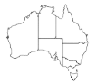</a></td>
<td align="center"><a href="https://github.com/dntzhang/wechart/blob/master/packages/path/examples/map/main.js">Source</a></td>
<td align="center">Path Source</td>
<td align="center">Tutorial</td>
</tr>
<tr>
<td align="center"><a title="Draw" href="https://dntzhang.github.io/wechart/packages/path/examples/simple/" rel="nofollow">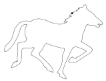</a></td>
<td align="center"><a href="https://github.com/dntzhang/wechart/blob/master/packages/path/examples/simple/main.js">Source</a></td>
<td align="center">Draw Source</td>
<td align="center">Tutorial</td>
</tr>

<tr>
<td align="center"><a title="Pyramid3d" href="https://dntzhang.github.io/wechart/packages/pyramid3d/examples/simple/" rel="nofollow">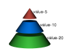</a></td>
<td align="center"><a href="https://github.com/dntzhang/wechart/blob/master/packages/pyramid3d/examples/simple/main.js">Source</a></td>
<td align="center"><a href="https://github.com/dntzhang/wechart/blob/master/packages/pyramid3d/src/index.js">Pyramid3d Source</a></td>
<td align="center">Tutorial</td>
</tr>
<tr>
<td align="center"><a title="Bar3d" href="https://dntzhang.github.io/wechart/packages/bar3d/examples/simple/" rel="nofollow">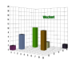</a></td>
<td align="center"><a href="https://github.com/dntzhang/wechart/blob/master/packages/bar3d/examples/simple/main.js">Source</a></td>
<td align="center"><a href="https://github.com/dntzhang/wechart/blob/master/packages/bar3d/src/index.js">Bar3d Source</a></td>
<td align="center">Tutorial</td>
</tr>
<tr>
<td align="center"><a title="Pie3d" href="https://dntzhang.github.io/wechart/packages/pie3d/examples/simple/" rel="nofollow">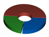</a></td>
<td align="center"><a href="https://github.com/dntzhang/wechart/blob/master/packages/pie3d/examples/simple/main.js">Source</a></td>
<td align="center"><a href="https://github.com/dntzhang/wechart/blob/master/packages/pie3d/src/index.js">Pie3d Source</a></td>
<td align="center">Tutorial</td>
</tr>
</tbody></table>

## 怎么贡献图[表]？

* 在 packages 以图表的名字新建一个文件夹，比如 chart-name
* 组件的例子放在 examples 目录，比如 simple，组件 Group 源码放在 src 目录
* 执行 `npm install` 安装依赖
* 执行 `npm run build chart-name simple` 进行构建
    
build 命令会自动打开浏览器中对应目录的 html (如果3000端口没占用，占用的话会递增):

```
http://localhost:3000/chart-name/examples/simple/index.html
```

修改目录下的文件会自动刷新网页。

## Cax DEMO

* Web DEMO & [→ Source Code](https://github.com/dntzhang/cax/tree/master/packages/cax/examples)
  * [Simple](https://dntzhang.github.io/cax) 
  * [Animation](https://dntzhang.github.io/cax/packages/cax/examples/to/) 
  * [Clip](https://dntzhang.github.io/cax/packages/cax/examples/clip/) 
  * [Clip Transform](https://dntzhang.github.io/cax/packages/cax/examples/clip-transform/) 
  * [Clip Transition](https://dntzhang.github.io/cax/packages/cax/examples/clip-transition/) 
  * [To2To Animate](https://dntzhang.github.io/cax/packages/cax/examples/to-animate/) 
  * [Swing](https://dntzhang.github.io/cax/packages/to/examples/swing/) 
  * [Cax + Matter](https://dntzhang.github.io/cax/packages/cax/examples/matter/) 
  * [To + Shape](https://dntzhang.github.io/cax/packages/cax/examples/to-shape/)
  * [Vision](https://dntzhang.github.io/cax/packages/cax/examples/vision/)
  * [Cache](https://dntzhang.github.io/cax/packages/cax/examples/cache/)
  * [Filter](https://dntzhang.github.io/cax/packages/cax/examples/filter/)
  * [SVG](https://dntzhang.github.io/wechart/packages/path/examples/man/)
  * [Graphics](https://dntzhang.github.io/cax/packages/cax/examples/graphics/)
  * [Composite Operation](http://dntzhang.github.io/cax/packages/cax/examples/composite-operation/)

## 谁在使用？

  

## 微信交流群【2】

 

## License

MIT @腾讯微信支付 @腾讯AlloyTeam
