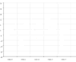
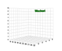

简体中文 | [English](./README.EN.md) 

# Wechart by [Cax](https://github.com/dntzhang/cax)

> Cax 和 three.js 渲染精巧图表

| Demo      |Usage Source   |Group Source   |Tutorial    |
|:---:|:---:|:----:|:---:|
|| [Source](https://github.com/dntzhang/wechart/blob/master/packages/excel/examples/simple/main.js) | [Excel Source](https://github.com/dntzhang/wechart/blob/master/packages/excel/src/index.js) | Tutorial| 
| | [Source](https://github.com/dntzhang/wechart/blob/master/packages/pie/examples/simple/main.js) | [Pie Source](https://github.com/dntzhang/wechart/blob/master/packages/pie/src/index.js) | [Tutorial](https://github.com/dntzhang/wechart/blob/master/packages/pie/README.md)| 
| | [Source](https://github.com/dntzhang/wechart/blob/master/packages/axis/examples/simple/main.js) | [Axis Source](https://github.com/dntzhang/wechart/blob/master/packages/axis/src/index.js) | Tutorial| 
|| [Source](https://github.com/dntzhang/wechart/blob/master/packages/bar/examples/simple/main.js) | [Bar Source](https://github.com/dntzhang/wechart/blob/master/packages/bar/src/index.js) | Tutorial| 
|| [Source](https://github.com/dntzhang/wechart/blob/master/packages/bar/examples/horizontal/main.js) | [Bar Source](https://github.com/dntzhang/wechart/blob/master/packages/bar/src/index.js) | Tutorial| 
| | [Source](https://github.com/dntzhang/wechart/blob/master/packages/cylinder/examples/simple/main.js) | [Cylinder Source](https://github.com/dntzhang/wechart/blob/master/packages/cylinder/src/index.js) | [Tutorial](https://github.com/dntzhang/wechart/blob/master/packages/cylinder/README.md)| 
|| [Source](https://github.com/dntzhang/wechart/blob/master/packages/line/examples/simple/main.js) | [Line Source](https://github.com/dntzhang/wechart/blob/master/packages/line/src/index.js) | Tutorial| 
|| [Source](https://github.com/dntzhang/wechart/blob/master/packages/graph/examples/simple/main.js) | [Graph Source](https://github.com/dntzhang/wechart/blob/master/packages/graph/src/index.js) | Tutorial| 
|| [Source](https://github.com/dntzhang/wechart/blob/master/packages/map/examples/simple/main.js) | [Map Source](https://github.com/dntzhang/wechart/blob/master/packages/map/src/index.js) | Tutorial| 
|| [Source](https://github.com/dntzhang/wechart/blob/master/packages/radar/examples/simple/main.js) | [Radar Source](https://github.com/dntzhang/wechart/blob/master/packages/radar/src/index.js) | Tutorial|  
|| [Source](https://github.com/dntzhang/wechart/blob/master/packages/map/examples/tiger/main.js) | Tiger Source|  Tutorial| 
| | [Source](https://github.com/dntzhang/wechart/blob/master/packages/path/examples/map/main.js) | Path Source|  Tutorial| 
|| [Source](https://github.com/dntzhang/wechart/blob/master/packages/path/examples/simple/main.js) | Draw Source|  Tutorial| 
| | [Source](https://github.com/dntzhang/wechart/blob/master/packages/axis3d/examples/simple/main.js) | [Axis3d Source](https://github.com/dntzhang/wechart/blob/master/packages/axis3d/src/index.js) | Tutorial| 
|| [Source](https://github.com/dntzhang/wechart/blob/master/packages/pyramid3d/examples/simple/main.js) | [Pyramid3d Source](https://github.com/dntzhang/wechart/blob/master/packages/pyramid3d/src/index.js) | Tutorial| 
|| [Source](https://github.com/dntzhang/wechart/blob/master/packages/bar3d/examples/simple/main.js) | [Bar3d Source](https://github.com/dntzhang/wechart/blob/master/packages/bar3d/src/index.js)  |  Tutorial| 
|| [Source](https://github.com/dntzhang/wechart/blob/master/packages/pie3d/examples/simple/main.js) | [Pie3d Source](https://github.com/dntzhang/wechart/blob/master/packages/pie3d/src/index.js) | Tutorial| 
|| [Source](https://github.com/dntzhang/wechart/blob/master/packages/map3d/examples/simple/main.js) | [Map3d Source](https://github.com/dntzhang/wechart/blob/master/packages/map3d/src/index.js) | Tutorial| 
|| [Source](https://github.com/dntzhang/wechart/blob/master/packages/earth/examples/simple/main.js) | [Earth Source](https://github.com/dntzhang/wechart/blob/master/packages/earth/src/index.js) | Tutorial| 

## 怎么贡献图表？

* 在 packages 以图表的名字新建一个文件夹，比如 chart-name
* 组件的例子放在 examples 目录，比如 simple，组件 Group 源码放在 src 目录
* 执行 `npm install` 安装依赖
* 执行 `npm run build -- chart-name simple` 进行构建
* 在浏览器中以 webserver 的形式访问对应目录的 index.html 进行查看和调试

## 谁在使用？

  

## 微信交流群【2】

 

## License

MIT @腾讯微信支付 @腾讯AlloyTeam
