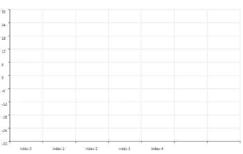

## Axis

Axis chart by cax

* [Simple Demo Preview](https://dntzhang.github.io/wechart/packages/axis/examples/simple/)



## Usage

Create axis:

```js
const axis = new Axis({
    interval: 1,
    from: 0,
    mapping: [1, 100],
    x: 30,
    y: 450,
    to: 7,
    color: 'black',
    text: {
        color: '#444',
        value: (index, data) => {
            return 'index-' + index
        },
        x: 30,
        y: 10,
        font: '10px Verdana',
        range: [0, 4],
        rotation: 0
    },
    gird: {
        color: '#ddd',
        length: 400
    }
}, 'bottom')

```

Render to stage:

```js
const stage = new cax.Stage(640, 400, 'body')
stage.add(pie)
stage.update()
```

