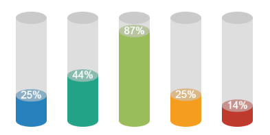
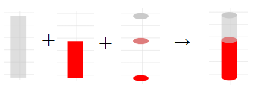
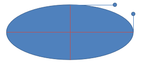

## Canvas 绘制 3d 圆柱体



* [Preview](https://dntzhang.github.io/wechart/packages/cylinder/examples/simple/) | [Source](https://github.com/dntzhang/wechart/blob/master/packages/cylinder/examples/simple/main.js) | [Cylinder Source](https://github.com/dntzhang/wechart/blob/master/packages/cylinder/src/index.js)  | [Tutorial](https://github.com/dntzhang/wechart/blob/master/packages/cylinder/README.md)
* [Wechart by Cax](https://github.com/dntzhang/wechart) 
* [Cax](https://github.com/dntzhang/cax)

众所周知 Cax 是基于 2d Canvas 的跨平台(小游戏、小程序和Web)渲染引擎。但是能够绘制 3d 图表吗？ 答案是可以！有两种方式:

* 自己计算透视投影最终各个点的坐标，然后连接填充起来
* 自己按照眼睛成像经验直接绘制 3d 的 2d 图像

本文将使用第二种方式。


## 快速开始

```js
const cy = new Cylinder(60, 200, 0.5, 'red')
stage.add(cy)
stage.update()
```

因为 Cylinder 也是继承自 cax.Group 的自定义 element，所以可以直接添加到stage渲染展示。显示效果如下:


会发现使用的时候只需要传一个颜色遍可以，怎么做到的？圆柱体里包含了三种颜色是怎么来的？且看原理。

## 实现原理



一图胜千言，就这么简单！

* 左边第一张是半透的灰色
* 第二张是红色
* 第三张顶部椭圆是灰色，中间椭圆是半透的灰色椭圆盖住红色椭圆，底部是红色椭圆
* 第四张是最终合成的图像！

且看部分实现代码:

```js
const btRect = new Graphics()
btRect.beginPath().fillStyle(color).fillRect(0, 0, width, height - th)
btRect.y = th

const topEllipse = new Ellipse(width, width / 2.5, {
    fillStyle: bottleColor
})
topEllipse.y = shortSize * -1

const middleEllipse = new Ellipse(width, width / 2.5, {
    fillStyle: color
})
middleEllipse.y = th - shortSize

const middleEllipseMask = new Ellipse(width, width / 2.5, {
    fillStyle: bottleColor
})
middleEllipseMask.alpha = 0.618
middleEllipseMask.y = th - shortSize

const bottomEllipse = new Ellipse(width, width / 2.5, {
    fillStyle: color
})
bottomEllipse.y = height - shortSize

this.add(topRect, topEllipse, btRect, bottomEllipse, middleEllipse, middleEllipseMask)
```

cax 内置的对象可以通过调整 alpha 来设置透明度，非常灵活方便，完整代码请到这里查看 [→ Cylinder Source](https://github.com/dntzhang/wechart/blob/master/packages/cylinder/src/index.js)

那么问题来了？椭圆怎么拟合？

### 椭圆

CanvasRenderingContext2D.ellipse() 是 Canvas 2D API 添加椭圆路径的方法。椭圆的圆心在（x,y）位置，半径分别是radiusX 和 radiusY ，按照anticlockwise（默认顺时针）指定的方向，从 startAngle  开始绘制，到 endAngle 结束。

但是！这是一个实验中的功能，不能在兼容所有浏览器。

且看 [→ cax 怎么实现的](https://github.com/dntzhang/cax/blob/master/packages/cax/src/render/display/shape/ellipse.js)！

```js

import Shape from './shape'

class Ellipse extends Shape {
  constructor (width, height, option) {
    super()
    this.option = option || {}
    this.width = width
    this.height = height
  }

  draw () {
    const w = this.width
    const h = this.height
    const k = 0.5522848
    const ox = (w / 2) * k
    const oy = (h / 2) * k
    const xe = w
    const ye = h
    const xm = w / 2
    const ym = h / 2

    this.beginPath()
    this.moveTo(0, ym)
    this.bezierCurveTo(0, ym - oy, xm - ox, 0, xm, 0)
    this.bezierCurveTo(xm + ox, 0, xe, ym - oy, xe, ym)
    this.bezierCurveTo(xe, ym + oy, xm + ox, ye, xm, ye)
    this.bezierCurveTo(xm - ox, ye, 0, ym + oy, 0, ym)

    if (this.option.strokeStyle) {
      if (this.option.lineWidth !== undefined) {
        this.lineWidth(this.option.lineWidth)
      }
      this.strokeStyle(this.option.strokeStyle)
      this.stroke()
    }

    if (this.option.fillStyle) {
      this.fillStyle(this.option.fillStyle)
      this.fill()
    }
  }
}

export default Ellipse
```



通过 4 条贝赛尔曲线去拟合一个椭圆。

更多图表教程请关注 [Wechart by Cax](https://github.com/dntzhang/wechart) ，我们将持续更新！

## Cax 和 Wechart 微信交流群2


## License

MIT