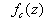
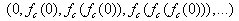

## 曼德勃罗集合

曼德勃罗特集是人类有史以来做出的最奇异,最瑰丽的几何图形，曾被称为“上帝的指纹”。 这个点集均出自公式:Zn+1=(Zn)^2+C，对于非线性迭代公式Zn+1=(Zn)^2+C，所有使得无限迭代后的结果能保持有限数值的复数C的集合，构成曼德勃罗集。

## 计算

Mandelbrot集合可以用下面的复二次多项式定义：Zn+1=(Zn)^2+C

其中c是一个复数。对于每一个c，从z=0开始对函数进行迭代。序列的值或者延伸到无限大，或者只停留在有限半径的圆盘内。
Mandelbrot集合就是使以上序列不发散的所有c点的集合。用程序绘制Mandelbrot集合时不能进行无限次迭代，最简单的方法是使用逃逸时间（迭代次数）进行绘制，具体算法如下：

* 判断每次调用函数得到的结果是否在半径R之内，即复数的模小于R
* 记录下模大于R时的迭代次数
* 迭代最多进行N次
* 不同的迭代次数的点使用不同的颜色绘制

## 具体推导

我们把形如a+bI（a,b均为实数）的数称为复数，其中a称为实部，b称为虚部，I称为虚数单位。

定义复数（下面用r标识实部，i称为虚部）：

```js
var Complex = function (r, i) {
    this.r = r;
    this.i = i;
}
```

从 Zn+1=(Zn)^2+C 得出:

```
this.r*this.r + this.i*this.i*I*I + 2*this.r*this.i*I + C
``` 

因为 I*I 为-1, 推导得出:

* new r 为 this.r*this.r - this.i*this.i + C.r 
* new i 为 2*this.r*this.i + C.i

所以得出方法定义:

```js
  Complex.prototype = {
    madIteration: function (r, i) {
      return new Complex(this.r * this.r - this.i * this.i + r, 2 * this.r * this.i + i);
    },
    modulusSqu: function () {
      return this.r * this.r + this.i * this.i;
    }
  }
```

渲染:
```js
function render(iterMax) {
    context.clearRect(0, 0, w, h);
    var imageData = context.getImageData(0, 0, 600, 400),
      iter = 0,
      current,
      temp;
    for (var x = 0; x < w; x++) {
      for (var y = 0; y < h; y++) {
        //x 和y 转换实部和虚部
        current = new Complex(x / 100 - 3, y / 100 - 2);
        temp = current;
        iter = 0;
        //mad 迭代判断复数C(即 current)
        while (temp.modulusSqu() <= 4 && iter < iterMax) {
          temp = temp.madIteration(current.r, current.i)
          iter = iter + 1;
        }
        var index = 4 * (canvas.width * y + x),
          color = colorRgb(colors[iter % 7]);
        if (iter > 7) {
          color =  colorRgb( '#e24337')
        }
        if (iter !== iterMax) {
          imageData.data[index] = color[0];
          imageData.data[index + 1] = color[1];
          imageData.data[index + 2] = color[2];
        }
        imageData.data[index + 3] =  255;
      }
    }
    context.putImageData(imageData, 0, 0);
  }
```