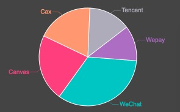
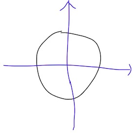

## Cax 渲染的精致响应式饼图



* [Preview](https://dntzhang.github.io/wechart/packages/pie/examples/simple/) | [Usage Source](https://github.com/dntzhang/wechart/blob/master/packages/pie/examples/simple/main.js) | [Pie Source](https://github.com/dntzhang/wechart/blob/master/packages/pie/src/index.js) | [Tutorial](https://github.com/dntzhang/wechart/blob/master/packages/pie/README.md)
* [Wechart by Cax](https://github.com/dntzhang/wechart) 
* [Cax](https://github.com/dntzhang/cax)

众所周知 Cax 既能开发游戏、又能开发图表。本文将从饼图开始 Wechart 的图表之旅。
Wechart 完全基于 Group 体系构建(自定义 Element) ，以维护、可插拔使用，可扩展。

## 快速开始

创建饼图实例:

```js
const pie = new Pie([
    { name: 'WeChat', value: 10 },
    { name: 'Canvas', value: 15 },
    { name: 'Cax', value: 23 },
    { name: 'Tencent', value: 7 },
    { name: 'Wepay', value: 22 }
], {
        processing: (item) => { 
            return item.value 
        },
        x: 200,
        y: 200,
        r: 160,
        circleColor: 'white',
        textOffsetY: -12,
        font: '20px Arial',
        color: (index) => {
            return ['#4BC0C0', '#FF6485', '#FFA07A', '#ADACB9', '#A37AC1'][index]
        },
        label: (item) => {
            return item.name
        },
        tooltip: (item) => {
            return item.name + '<br/>' + item.value
        }
    }
)
```

上面各项配置项很清晰明了，不做解释，开发者可自行修改参数看饼图的变化，下面把饼图添加到舞台:

```js
const stage = new cax.Stage(640, 400, 'body')
stage.add(pie)
stage.update()
```

stage 是最大的容器，通过 add 方法往里面加对象，然后 update 舞台就能显示。

显示和隐藏饼图:

```js
pie.show()
pie.hide()
```

## 实现原理

看到上面的 DEMO 可以会有几方面技术需要讲解：

* Pie 对象和 Group 的关系
* Cax 扇形绘制
* 展开和收缩动画实现
* 文字和文字走线显示在对应扇形的中间
* 显示兼容 PC 和 Mobile 
* 交互兼容 PC 和 Mobile 
* 渐变和点击弹出和移除收缩实现
* Tooltip 实现

### Pie 对象和 Group 的关系

先看 cax 内置的 Group 对象, Group 用于分组， group 也可以嵌套 group，父容器的属性会叠加在子属性上, 比如：

* group 的 x 是 100, group 里的 bitmap 的 x 是 200， 最后 bitmap 渲染到 stage 上的 x 是 300
* group 的 alpha 是 0.7, group 里的 bitmap 的 alpha 是 0.6, 最后 bitmap 渲染到 stage 上的 alpha 是 0.42

```js
const group = new cax.Group()
const rect = new cax.Rect(100, 100 {
  fillStyle: 'black'
})
group.add(rect)
stage.add(group)
stage.update()
```

Pie 对象正是自定义 Element，继承自 Group:

``` js
class Pie extends Group {
  constructor (data, option) {
    super()
```

一般情况下，稍微复杂组合体都建议使用继承自 Group，这样利于扩展也方便管理自身内部的元件。
可以看到小游戏的 DEMO 里的 [Player、Bullet、Enemy、Background](https://github.com/dntzhang/cax/tree/master/packages/cax-wegame/js) 全都是继承自 Group。


### 扇形绘制

Cax 内置 Graphics，可以使用连缀 Canvas API 的方式绘制图形:

```js
const sector = new cax.Graphics()
sector
    .beginPath()
    .moveTo(0, 0)
    .arc(0, 0, 30, 0, Math.PI/2)
    .closePath()
    .fillStyle('green')
    .fill()
    .strokeStyle('red')
    .lineWidth(2)
    .stroke()

stage.add(sector)
```

这里假设你已经创建好了舞台。效果如下:


所以一个饼图就是把圆分成若干个扇形。怎么分？ arc 方法传入动态数据：

```js
let current = 0

data.forEach((item, index) => {
    const sector = new cax.Graphics()
    sector
        .beginPath()
        .moveTo(0, 0)
        .arc(0, 0, 30, current, current += Math.PI * 2 * item.value / totalValue)
        .closePath()
        .fillStyle('green')
        .fill()
        .strokeStyle('red')
        .lineWidth(2)
        .stroke()
})
```

其中 totalValue 为所有 item.value 的和。可以看到上面是平分一个圆。那么怎么平分一个扇形？能运动平分的角度吗？

### 展开和收缩动画实现

看这行代码:

``` js
.arc(0, 0, 30, current, current += Math.PI * 2 * item.value / totalValue)
```

把  Math.PI * 2  改成 totalAngle 动态变量就可以！

``` js
let totalAngle = 0
...
...
.arc(0, 0, 30, current, current += totalAngle * item.value / totalValue)
```

运动 totalAngle 并且进行重绘:

```js
 cax.To.get(option)
      .to({ totalAngle: Math.PI * 2 }, option.duration, option.easing)
      .progress((object) => {
        current = option.begin
        sectorGroup.forEach((item, index) => {
          item
            .clear()
            .beginPath()
            .moveTo(0, 0)
            .arc(0, 0, r, current, current += object.totalAngle * option.processing(item) / totalValue)
            .closePath()
            .fillStyle(option.color(index))
            .fill()
            .strokeStyle(option.circleColor)
            .lineWidth(2)
            .stroke()
            .closePath()
        })
      })
    ...
    ...
    ...
```

使用 cax 内置的 to2to 运动能力。这里需要提醒的是，progress 方法会不断地执行，为了防止 sector 的 graphics path 不断叠加，在循环执行的代码里一定要调用 clear 来清除 graphics 的以前的 Canvas 绘制命令。

### 文字和文字走线

文字和走线分四种情况:



```js
if (angle >= 0 && angle < Math.PI / 2) {
        
} else if (angle >= Math.PI / 2 && angle < Math.PI) {
    
} else if (angle >= Math.PI && angle < Math.PI + Math.PI / 2) {
    
} else 

}
```

需要注意的是：

* 落在左边的文字的 x 坐标需要减去文件的宽度。 Cax 内置的 Text 可以使用 getWidth() 方法获取到文字的宽度
* 走线的第一根线角度也分两种情况，1、3象限平行，2、4象限平行，走线的第二根先角度都是平行于 y 轴（如上图所示，相同颜色圈中的线是平行的）

### 显示与交互兼容 PC 和 Mobile

从 javascript 里会发现 canvas 的宽高是 640*400：

``` js
const stage = new cax.Stage(640, 400, 'body')
```

就和我们平时使用两倍图一样，在移动端通过 media 把 canvas 变成一半宽度:

``` css
 @media screen and (max-width: 500px) {  
        canvas {
            width : 320px
        }
}
```

这个时候会出现一个问题！因为 cax 会把 canvas 上的事件过度给 cax 内置对象，事件发生的坐标因为 canvas 宽高的变化而变化了， 移动端点击事件触发位置不准确了！这个时候需要 scaleEventPoint 方法来校正坐标：

``` js
if (window.innerWidth <= 500) {
    stage.scaleEventPoint(0.5, 0.5)
}
```

搞定！这样不管是在 PC 鼠标还是移动 Mobile 触摸都能精准触发事件。

### 渐变和点击弹出和移除收缩实现

```js
function fadeIn(obj) {
  obj.alpha = 0
  To.get(obj).to({ alpha: 1 }, 600).start()
}

function fadeOut(obj) {
  obj.alpha = 1
  To.get(obj).to({ alpha: 0 }, 600).start()
}

function bounceIn(obj, from, to) {
  from = from || 0
  obj.from = from
  To.get(obj).to({ scaleX: to || 1, scaleY: to || 1 }, 300, cax.easing.bounceOut).start()
}

function bounceOut(obj, from, to) {
  from = from || 1
  obj.from = from
  To.get(obj).to({ scaleX: to || 0, scaleY: to || 0 }, 300, cax.easing.bounceOut).start()
}
```

基于 cax 内置的 to2to 动画引擎封装了四个方法。

### Tooltip 实现

```js
sector.hover(function (evt) {
    bounceIn(sector, 1, 1.1)
    tooltip.style.left = (evt.pureEvent.pageX + 5) + 'px'
    tooltip.style.top = (evt.pureEvent.pageY + 5) + 'px'
    tooltip.innerHTML = option.tooltip(data[index])
    tooltip.style.display = 'block'
}, function (evt) {
    bounceOut(sector, 1.1, 1)
    tooltip.style.display = 'none'
}, function (evt) {
    tooltip.style.left = (evt.pureEvent.pageX + 5) + 'px'
    tooltip.style.top = (evt.pureEvent.pageY + 5) + 'px'
})
```

Cax 内置对象拥有 `hover(over, out, move)` 方法来监听鼠标或者手指 over、out 和 move。

Tooltip 也是完全基于 DOM 来实现的，这样可以浮在 Canvas 外面，而不会限制在 Canvas 里面。

## 谁在使用？

  

## Cax 和 Wechart 微信交流群


## License

MIT