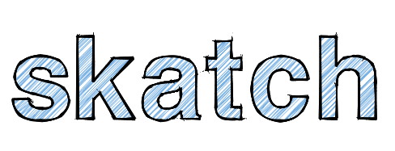

<p align="center">
  <a href ="https://dntzhang.github.io/wechart/packages/skatch/examples/letter/"></a>
</p>
<h5 align="center" style="font-size:30px;">
极速渲染抽象派草图
</h5>

## DEMO

* [Simple](https://dntzhang.github.io/wechart/packages/skatch/examples/simple/)
* [Letter](https://dntzhang.github.io/wechart/packages/skatch/examples/letter/)

## 简介

 Skatch 这个词由 sketch wechart abstract cax 混合而成的一个新词，代表了cax wechart 抽象艺术派派草图渲染器。说得直白一点就是npm 上 sketch 被 tj 占了，只能强行加上赋予某些意义合成 skatch 这个词。关于我的合成词的相关库最满意的非 pasition (path transition) 莫属了。

## 使用

``` js
const skatch = new Skatch({
  randomRange: 10,      //点的抖动范围
  
  strokeRepeat: 12,   //重复绘制的次数
  strokeWidth: 1,      //绘制线宽
  strokeStyle: 'black',//绘制颜色

  gap: 5, //填充线的间距
  fillAngle: -45,//填充线的角度
  curveRange: 45, //填充线扭曲范围
  fillWidth: 1, //填充线的线宽
  fillRepeat: 2,//填充线重复填充的次数
  fillStyle: '#6aa8df',//填充线的颜色

  filter: 1 //绘制 path 的时候过滤的比例，范围是 (0-1)
})

skatch.circle(310, 280, 50)
stage.add(skatch)
stage.update()
```

由于 skatch 是 cax 自定义 Element(继承自 cax.Group)，所以拥有[设置所有属性的能力](https://github.com/dntzhang/cax#%E5%B1%9E%E6%80%A7),如下所示:

### Transform

|属性名      |描述   |
|---|---|
| x | 水平偏移 |
| y | 竖直偏移 |
| scaleX | 水平缩放 |
| scaleY | 竖直缩放 |
| rotation | 旋转 |
| skewX | 歪斜 X |
| skewY | 歪斜 Y |
| originX | 旋转基点 X |
| originY | 旋转基点 Y |

### Alpha

|属性名      |描述   |
|---|---|
| alpha | 元素的透明度 |

注意这里父子都设置了 alpha 会进行乘法叠加。

### compositeOperation 

|属性名      |描述   |
|---|---|
| compositeOperation | 源图像绘制到目标图像上的叠加模式 |

注意这里如果自身没有定义 compositeOperation 会进行向上查找，找到最近的定义了 compositeOperation 的父容器作为自己的 compositeOperation。

### Cursor

|属性名      |描述   |
|---|---|
| cursor | 鼠标移上去的形状 |

### Fixed

|属性名      |描述   |
|---|---|
| fixed | 是否固定定位，默认是 false 设置成 true 不会叠加祖辈们的 transform 属性|

### Shadow

|属性名      |描述   |
|---|---|
| shadow | 阴影|

使用方式:

```js
obj.shadow = {
    color: '#42B035',
    offsetX: -5,
    offsetY: 5,
    blur: 10
}
```

skatch 共拥有如下方法进行草图绘制:

* rect
* circle
* ellipse
* path
* strokeRect
* strokeCircle
* strokeEllipse
* strokePath
* fillRect
* fillCircle
* fillEllipse
* fillPath

可以这么理解: rect === strokeRect + fillRect 。其他的形状以此类推。

## 与 rough 的异同

[Rough](https://github.com/pshihn/rough) 是非常著名的草图渲染库，看上去 skatch 和 rough 非常类似，但是有着本质的不同。

* Rough 使用纯数据进行绘制前的计算（比如线段与线段、线段与圆、线段与椭圆等）
* Skatch 使用 简单计算 + clip + 图层合成 + 坐标 shake

看上去 skatch 过程复杂？所以速度更慢？大错特错！Skatch clip 和 图层的行为都是纯图像处理，在 GPU 中完成，有硬件加速，小部分任务在 CPU 中完成。
也可以这样理解 rough 主要计算放在 CPU，skatch主要计算放在了 GPU。Skatch 具体的原理等待我的教程。


## Star & Follow

* [skatch](https://github.com/dntzhang/wechart/tree/master/packages/skatch)
* [@dntzhang](https://github.com/dntzhang/)

## 微信交流群【2】

 

## License

MIT 
